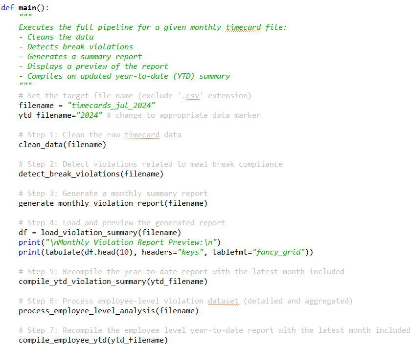

# Golden Valley Software – Meal Break Compliance Evaluation

## California Meal Break Law Overview

Under **California Labor Code § 512(a)** and applicable **Wage Orders**:

- An employer **may not employ any employee** for a work period of **more than five (5) hours** per day **without providing a 30-minute unpaid, duty-free meal period**.
- The **meal break must begin before the end of the fifth hour** of work.  
  ⤷ In practice, this means **the lunch break must begin no later than 4 hours and 59 minutes after clock-in**.

**Example:**  
If an employee clocks in at **8:00 AM**, their lunch must begin **by 12:59:59 PM** to comply.

### Waiver Clause – California Labor Code § 512 and Wage Orders

A **first meal period** may be waived under the following conditions:

- The employee's **total shift duration is no more than six (6) hours**  
- The **meal period is waived voluntarily** by mutual agreement between employer and employee  
- The waiver is **signed and retained** for audit or legal review

**Key compliance detail:**  
With a valid waiver in place, the employee is **not required to begin the meal period before the end of the fifth hour**. Instead, the lunch (if taken) may begin **any time up to the end of the sixth hour** (i.e., no later than 5 hours and 59 minutes after clock-in).

If no waiver exists, a meal period must start **no later than the end of the fifth hour** of work.

In all cases, if a lunch is taken, it must be **30 minutes long, unpaid, and duty-free**.

---

This compliance evaluation software uses these standards to detect:
- On-time lunches
- Late lunches without waiver
- Late lunches with waiver (allowed, but tracked)
- Missed lunches

These outputs are compiled monthly and year-to-date to aid HR policy reviews and proactive compliance.

## Project Summary

This project delivers a fully automated **Python-based compliance pipeline** that evaluates adherence to California's meal break law (Labor Code § 512). It is designed to scale across months, ensuring consistent monitoring and risk detection for HR and operations teams.

The pipeline performs the following steps end-to-end:

1. **Ingest** raw monthly timecard data (`.csv`)
2. **Clean** the dataset to ensure structural integrity and filter out unusable rows
3. **Detect violations** based on lunch timing and waiver status, using encoded business logic aligned with California law
4. **Generate reports** that summarize valid shifts, violations, and their breakdown by type
5. **Compile year-to-date (YTD) summaries** automatically as each new month's data is processed

This is a **turnkey solution**: once raw data is dropped into the folder, the pipeline handles everything from compliance checks to summary reporting **no manual intervention required**.


### Current Findings – Golden Valley Software


- **40.7%** of employee shifts have resulted in a violation of Labor Code § 512(a).  
- **Figure 1:** Violation rate by month  
- **Figure 2:** Violation breakdown by type  

**Violation Breakdown:**


These results indicate that Golden Valley Software may be exposed to **significant litigation risk** if compliance is not addressed.

### Future Enhancements

Planned improvements include:

- Weekly and daily trend analysis  
- Employee-level violation frequency  
- Interactive dashboards with Tableau  

## Full Technical Report 

This is the **full technical report** that contains a detailed report of the components of the **pipeline**. 

### Dataset 

The dataset for this project was generated to simulate a company timecard sytem that contains information about employee work shifts and time-realted data. The dataset contains some **missing values** to simulate real world scenario.


### Pipeline Structure

This project is a **Python-based pipeline** that was created to automate the cleaning, preparation, and evaluation of a company dataset through a main module. All the user would have to do is drop the raw data into the data/raw folder with an appropriate name, input the name into the module code, and run the module.



**Cleaning Process**
1. Check the dataset for missing values
2. Log and exclude rows with missing clock_in or clock_out data (consult client for data correction)
3. Impute missing lunch_start if lunch_end is present (assume 30 minutes long).

**Evaluate Timecards**
1. Compute shift length.
2. Flag lunch_needed based on shift length and waiver_signed.
3. Flag violations for missed_lunch, late_lunch_no_waiver, and late_lunch_with_waiver
4. Generate summary report (month, total_shifts, violations, pct_violations, missed_lunch, late_lunch_no_waiver, late_lunch_waiver) 
5. Save the report with other monthly reports

**Compile Year-to-Date Dataset**
1. Compile the monthly reports into one database (uses saved report)
2. Update the Tableau dahsboard using the new ytd report. 


# How to Use This Project

This repository contains a fully automated Python pipeline for evaluating California Labor Code § 512(a) meal break compliance. Follow the steps below to run the tool on new monthly timecard data, generate compliance reports, and update the year-to-date summary.

## 1. Clone the Repository

```bash
git clone git@github.com:jmedinacs/gv_meal_break_law_compliance.git
cd gv_meal_break_law_compliance
```

> This project uses SSH. If you're not using an SSH key, you can also clone via HTTPS:
> `https://github.com/jmedinacs/gv_meal_break_law_compliance.git`

## 2. Set Up Your Python Environment

Ensure you have Python 3.9+ installed. Then install all required libraries:

```bash
pip install -r requirements.txt
```

> If you use virtual environments (recommended):
> ```bash
> python -m venv venv
> source venv/bin/activate  # or venv\Scripts\activate on Windows
> pip install -r requirements.txt
> ```

## 3. Add Your Monthly Timecard Data

Place your new raw monthly CSV file inside the `data/raw/` folder.  
Make sure the file includes the following columns:

| Column Name     | Description                                |
|------------------|--------------------------------------------|
| `employee_id`    | Unique employee identifier                 |
| `date`           | Date of the shift (YYYY-MM-DD)            |
| `clock_in`       | Clock-in time (HH:MM:SS)                  |
| `lunch_start`    | Start time of lunch break (if taken)      |
| `clock_out`      | Clock-out time (HH:MM:SS)                 |
| `waiver_signed`  | Boolean (`True`/`False`) if waiver exists |

> `lunch_end` is optional and not used in evaluation.

## 4. Run the Pipeline

Open and run `main_module.py` in your preferred IDE or directly via terminal.

```bash
python main_module.py
```

Inside the script, update the `FILENAME` variable to match the name of your raw CSV file (without the `.csv` extension). For example:

```python
FILENAME = "timecards_july_2024"
```

The pipeline will:

- Clean and validate the dataset
- Evaluate meal break compliance for all shifts
- Log any rows with unusable data (missing clock-in/out)
- Output a detailed monthly report
- Append the monthly report to a cumulative year-to-date report

## 5. View the Reports

All reports are automatically saved inside:

- `data/cleaned/` – cleaned shift-level dataset  
- `data/reports/` – summarized monthly and YTD violation reports  

Optional: Visuals for key metrics are saved inside `report_viz/`  
(These can be embedded in a dashboard or presentation)

## 6. Optional: Connect to Tableau Dashboard

Once the year-to-date report is generated, you can connect the file to a Tableau workbook for ongoing updates. Simply:

- Open your Tableau file  
- Refresh the connection to `data/reports/year_to_date_summary.csv`  
- Publish or export updated visuals  

## Example Output

Summary report with fields like:

| Month     | Total Shifts | Violations | Violation % | Missed Lunch | Late No Waiver | Late With Waiver |
|-----------|---------------|------------|--------------|---------------|----------------|-------------------|
| July 2024 | 400           | 163        | 40.7%        | 92            | 70             | 1                 |

Visuals:  
- `year_to_date_line_graph.png`  
- `violation_distribution.png`


